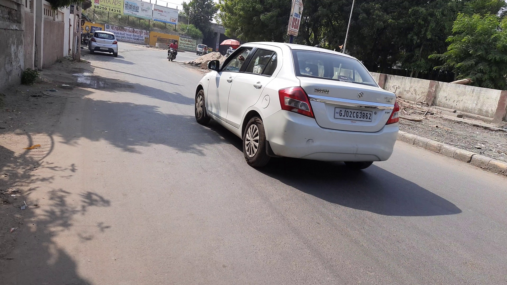
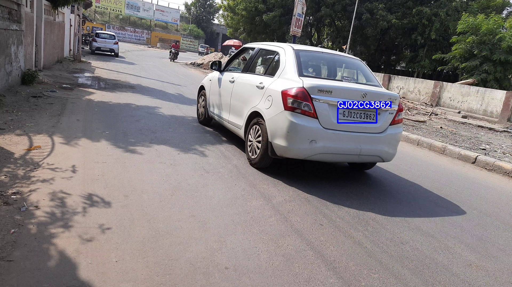

<h1 align="center"> Indian_LPR</h1>
<h3 align="center">Indian License Plate dataset in wild</h3>
<p align="center"> http://getplates.ml/ </p>

### We can't make dataset public because of legalities involved in making Indian Road data public, feel free to contact if you need any other help in your work. 
<p align="center">
    <a href="https://github.com/sanchit2843/Indian_LPR/master">
    
    <a href="https://github.com/sanchit2843/Indian_LPR/issues">
    
    <a href="https://github.com/sanchit2843/Indian_LPR/pulls">
    
    
</p>
 
<!-- TABLE OF CONTENTS -->
<h2 id="table-of-contents">Table of Contents</h2>

<details open="open">
  <summary>Table of Contents</summary>
  <ol>
    <li><a href="#about-the-project"> ➤ About The Project</a></li>
    <li><a href="#dataset"> ➤ Dataset</a></li>
    <li><a href="#folder-structure"> ➤ Folder Structure</a></li>
    <li><a href="#metrics"> ➤ Metrics</a></li>
    <li><a href="#training-instructions"> ➤ Training Instructions</a></li>
    <li><a href="#demo"> ➤ Demo</a></li>
    <li><a href="#acknowledgement"> ➤ Acknowledgement</a></li>
  </ol>
</details>


  
<!-- ABOUT THE PROJECT -->
<h2 id="about-the-project">  About The Project</h2>

<p align="justify"> 

<hr />
Indian Number (Licence) Plate Detection is a problem which hasn’t been explored much at an open source level. Most of the big datasets available are for countries like China , Brazil ,but the model trained on these don’t perform well on Indian plates because the font styles and plate designs being used in these countries are different. 
<hr />

</p>


<!-- DATASET -->
<h2 id="dataset"> Dataset</h2>
<p> 
<hr />

In this paper we introduce an Indian Number (licence) plate dataset with 16,192 images and 21683 number plates, along with that we introduce a benchmark model. We have annotated the plates using a 4 point box which helped us in using semantic segmentation for the detection step instead of object detection which is used in most plate detection models and then the characters are also labelled to train our lprnet based OCR for the recognition step

- We are currently understanding the legalities behind making Indian Road data public and cannot give an estimated date to make the data public. Sorry for the hassle, apart from the public datasets mentioned in paper, you can use these datasets for license plate recognition.
1. https://www.kaggle.com/datasets/kedarsai/indian-license-plates-with-labels
2. https://idd.insaan.iiit.ac.in/ (Will require annotation for number plates), this is just a Indian driving scene dataset. 
<hr />
</p>

<!-- FOLDER STRUCTURE -->
<h2 id="folder-structure"> Folder Structure</h2>

    code
    
    │
    ├── demo_images
    |
    ├── src
    │   ├── License_Plate_Recognition
    │   │
    │   ├── object_detection
    │   │
    │   ├── semantic_segmentation
    |
    ├── weights
    │   ├── best_lprnet.pth
    │   │
    │   ├── best_od.pth
    │   │
    │   ├── best_semantic.pth
    |
    ├── infer_objectdet.py
    ├── infer_semanticseg.py
    ├── README.md
    


<!-- Metrics -->
<h2 id="metrics">Metrics</h2>
<p align="justify"> 

<h3>Detection</h3>

- AP with IOU Threshold t=0.5
  
<hr />
  This AP metric is widely used to evaluate detections in the PASCAL VOC dataset. It measures the AP of each class individually by computing the area under the precision x recall curve interpolating all points. In order to classify detections as TP or FP the IOU threshold is set to t=0.5.
<hr />

<h3>Recognition</h3>

- Character level accuracy

<hr />
  Character accuracy is defined by the number of actual characters with their places divided by the total of actual characters i.e. how many characters are rightly detected.
<hr />

</p>


<!-- Benchmark -->
<h2 id="benchmark">Benchmark</h2>

<p align="justify"> 

In the tables below we present the result of model developed on the test split, the fps was evaluated on 2070 super gpu at a image resolution of 1920*1080.

|                       |    FPS  |    AP       |   
|-----------------------|---------|-------------|
|     FCOS(od)          |    12   |    0.8310   |
|    HRNet(semantic)    |    14   |    0.8313   | 


|  Cropping Method      |    Character Accuracy |
|-----------------------|-----------------------|
|    4 point            |          75.6         |
|    2 point            |          66.3         |

</p>

<!-- Training Instructions -->
<h2 id="training-instructions">Training Instructions</h2>

<hr />
We have created a baseline model with 2 stage approach, the first stage being the detection of number plates in an image, followed by a second stage to recognize the text in a cropped image of the plate. For the detection stage, we tested two separate models, one using object detection which has been well explored for the task of number plate detection in the past, the second using a semantic segmentation based model for number plate detection.
<hr />

<h3>Object Detection</h3>

<hr />
We used a FCOS with Hrnet based backbone. FCOS is a single stage object detection approach and thus works well in real time application such as ours. We used FCOS as the baseline model because FCOS is an anchor free approach and requires minimal hyper parameter tuning. The model was trained for 50 epochs with a batch size of 8 using ranger\cite{Ranger} optimizer. We used pixel level augmentation techniques with random change in brightness and contrast of image. No spatial data augmentation was used in the baseline experimentation. The model was trained with a fixed resolution of 1920*1080 as down sampling the image can make the number plates unreadable, random cropping was not used as well for the sake of simplicity.
<hr />

```

python src/object_detection/train.py --train_txt --batch_size --epochs

```

<h3>Semantic Segmentation</h3>

<hr />
We used similar Hrnet backbone for semantic segmentation model. This backbone is followed by a convolution layer with output channels equal to the number of classes i.e 2 (the background and number plate). We used cross entropy loss for training, with class weightage for background equal 0.05 and 0.95 for number plate class. We used Ranger optimizer with 0.01 as initial learning rate, and learning rate was decayed using polynomial learning rate decay with power 0.9. We trained the model for 50 epochs with a batch size of 8. Similar to object detection, only pixel level augmentation techniques were applied, which randomly changed the brightness and the contrast of the image. Image resolution for semantic segmentation was fixed at 1920*1080 and no cropping or downsampling was performed.
<hr />

```

python src/semantic_segmentation/training.py --csvpath --output_dir --n_classes --n_epoch --batch_size

```


<h3>License Plate Recognition</h3>

<hr />
We used LPRNet for character recognition because it is a lightweight Convolutional Neural Network with high accuracy. For our purpose we used LPRNet basic which is based on Inception blocks followed by spatial convolutions and trained with CTC loss. The model was trained for x epochs with ’Adam’ optimizer using batch size of 32 with initial learning rate of 0.001 and gradient noise scale of 0.001. Data augmentation used were random affine transformations,e.g. rotation, scaling and shift.
<hr />

```

python src/License_Plate_Recognition/train_LPRNet.py --train_img_dirs --test_img_dirs

```

<!-- Demo -->
<h2 id="demo">Demo</h2>

<h3>original image</h3>




<h3>object detection</h3>


```
python infer_objectdet.py --source demo_images/20201031_133155_3220.jpg

```



<h3>semantic segmentation</h3>

```
python infer_semanticseg.py --source demo_images/20201031_133155_3220.jpg

```


<!-- Acknowledgement -->
<h2 id="acknowledgement">Acknowledgement</h2>

<hr />
If you have any problems about <paper name>, please contact <sanchittanwar75@gmail.com>.

Please cite the paper @misc{tanwar2021indian,
      title={Indian Licence Plate Dataset in the wild}, 
      author={Sanchit Tanwar and Ayush Tiwari and Ritesh Chowdhry},
      year={2021},
      eprint={2111.06054},
      archivePrefix={arXiv},
      primaryClass={cs.CV}
}
, if you benefit from this dataset.
<hr />
